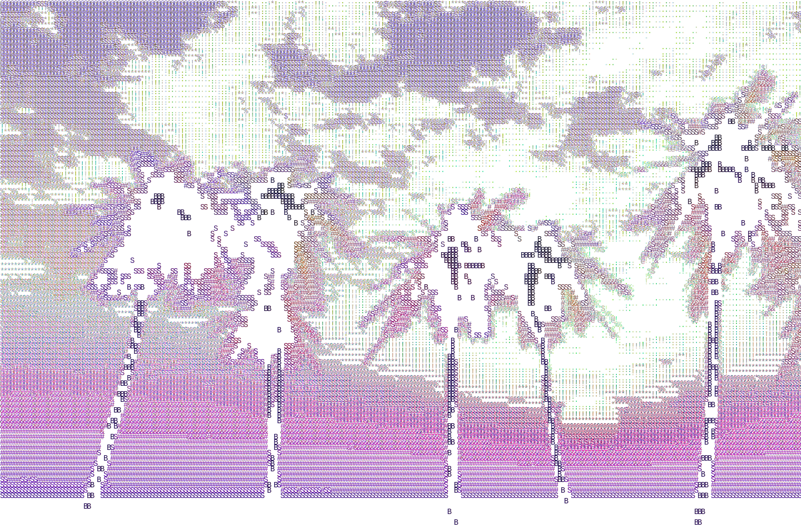

# ascii-image-generator



Generate ASCII art from images — plain text, colored terminal output, HTML, or SVG.

Based on [this article](https://dev.to/anuragrana/generating-ascii-art-from-colored-image-using-python-4ace), extended with ANSI color support, HTML/SVG output, rainbow gradients, color enhancement, and custom character ramps.

## Quick Start

```bash
# Install
pip install .

# Or just install the dependency and run directly
pip install Pillow
python -m ascii_art path/to/image.jpg
```

## Usage

```bash
# Plain ASCII art to terminal
ascii-art image.jpg --mode plain

# Colored ASCII art (auto-detects truecolor/256-color)
ascii-art image.jpg --mode color

# Save as HTML
ascii-art image.jpg --mode html -o output.html

# Save as SVG (scalable vector graphics)
ascii-art image.jpg --mode svg -o output.svg

# Rainbow gradient with enhanced colors
ascii-art image.jpg --mode svg --rainbow --brightness 1.5 --pixel-width 800

# Custom width and character set
ascii-art image.jpg -w 80 -c " .:-=+*#%@"

# Inverted colors with dots
ascii-art image.jpg --invert --chars " .·•●"
```

## Options

| Flag | Default | Description |
|------|---------|-------------|
| `-w, --width` | `120` | Output width in characters |
| `-m, --mode` | `color` | `plain`, `color`, `html`, or `svg` |
| `-c, --chars` | `B S#&@$%*!:. ` | Character ramp (dark → light) |
| `-s, --saturation` | `1.0` | Color saturation multiplier (try 1.5-2.0) |
| `-b, --brightness` | `1.0` | Brightness multiplier (try 1.2-1.5) |
| `--pixel-width` | - | Output width in pixels (HTML/SVG) |
| `--invert` | - | Invert image colors (negative) |
| `--rainbow` | - | Apply rainbow gradient |
| `--color-mode` | `auto` | `auto`, `truecolor`, `256`, or `none` |
| `-o, --output` | stdout | Save to file |

## Python API

```python
from ascii_art import image_to_ascii, get_color_data

# Plain text
art = image_to_ascii("photo.jpg", width=100)
print(art)

# With RGB color data (for custom rendering)
rows = get_color_data("photo.jpg", width=100)
for row in rows:
    for char, (r, g, b) in row:
        ...  # render however you want
```

## How It Works

1. Load the image with Pillow
2. Resize to target width, correcting for terminal character aspect ratio (0.55 factor)
3. Convert to grayscale
4. Map each pixel intensity to a character from the ramp
5. Optionally: grab original RGB colors and render with ANSI escapes, HTML spans, or SVG text elements
6. Apply color enhancements (saturation, brightness) or rainbow gradient if requested

## Development

```bash
pip install -e ".[dev]"
pytest
```

## License

MIT
